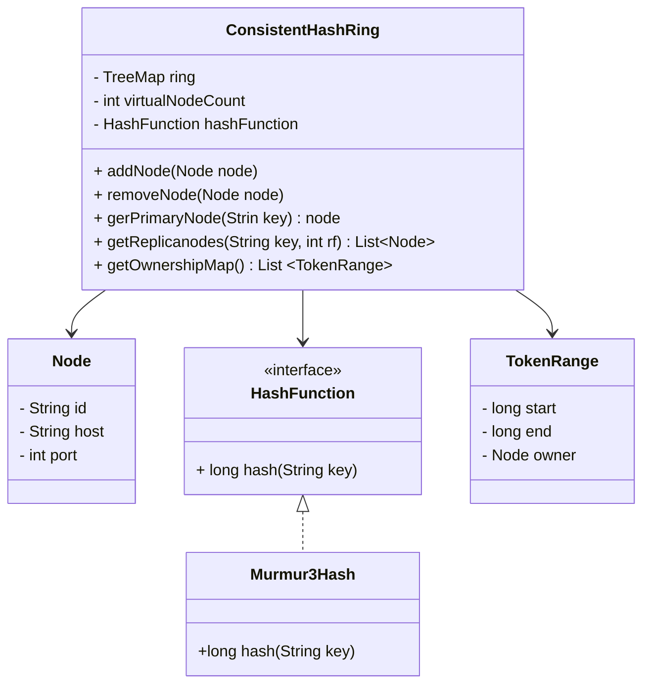

# Design a key-partitioning application following consistent Hashing

## What is consistent Hashing?
```mermaid

```

## What are we achieving in this project?
We are building a key-value partitioning system using consistent hashing.
## Scope
- In-memory key-value store
- Multiple nodes
- Virtual nodes
- Add/remove nodes dynamically
- Replication(optional advanced step)
- Rebalancing of nodes

## Functional Requirements
- Add node
- Remove node
- Put(key, value)
- Get(key)
- Even distribution
- Minimal key movement on node change

## Non-functional Requirements
- O(logN) lookup
- Scalable
- Deterministic hashing
- Thread-safe(optional Requirement)

## Data Model
## Design API??
## High Level Design

```mermaid
flowchart LR
    Client --> Coordinator
    Coordinator --> PartitionStrategy
    Coordinator --> ReplicationManager
    ReplicationManager --> NodeA
    ReplicationManager --> NodeB
    ReplicationManager --> NodeC
    ClusterManager --> PartitionStrategy

```
## Data/Request Flows
## Sequence diagram of each Flow
## Scaling
## Low Level Design





## Observability